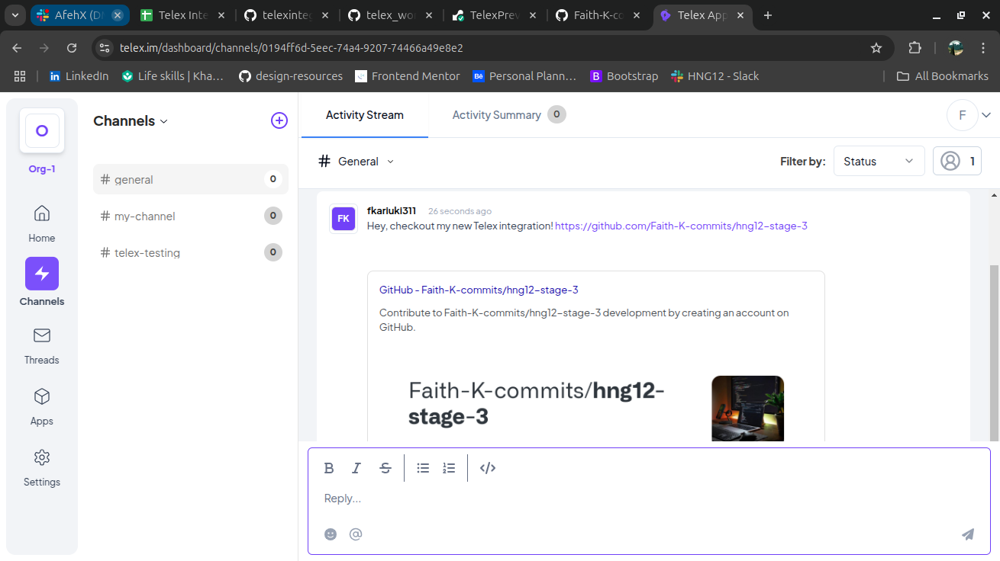
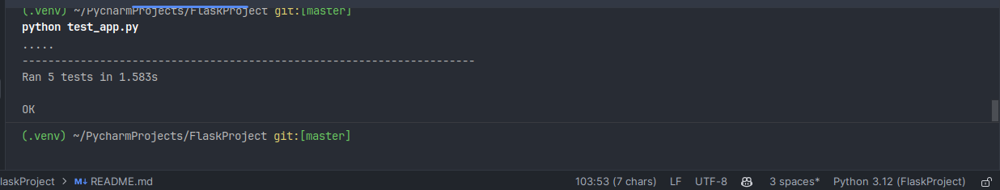

# Telex Link Preview Generator

## Overview
The **Telex Link Preview Generator** is a **Modifier Integration** for the [Telex](https://telex.im) platform. It detects URLs in messages and automatically fetches metadata (title, description, and thumbnail) to display a preview before posting the message.

## Features
- Detects URLs in messages
- Fetches metadata from web pages (title, description, image)
- Displays a rich link preview when you post a URL
- Enhances user experience by providing instant context for shared links

## Integration Type
**Modifier Integration** – Modifies new messages entering a channel by adding a link preview.

## How It Works
1. A user sends a message containing a URL in a Telex channel.
2. The integration detects the URL.
3. It fetches metadata (title, description, and thumbnail) using web scraping or Open Graph tags.
4. The message is modified to include a preview when posted.

## Setup & Deployment
1. Clone the repository:
   ```bash
   git clone https://github.com/Faith-K-commits/hng12-stage-3.git
   cd hng12-stage-3
   ```
2. Install dependencies:
   ```bash
   pip install -r requirements.txt
   ```
3. Run the Flask server:
   ```bash
   python app.py
   ```
4. Test with Postman or cURL:
   ```bash
   curl -X POST "http://localhost:5000/webhook" -H "Content-Type: application/json" -d '{"message": "https://example.com"}'
   ```

## API Endpoints
### **1. Preview Messages**
```http
POST /webhook
```
**Request Body:**
```json
{
  "message": "Check this out: https://example.com"
}
```
**Response:**
```json
{
  "modified_message": "Check this out: https://example.com\n\n📌 **Example Title**\n📝 Example description\n🖼️ [Thumbnail Image]"
}
```

### **1. Integration Endpoint**
```http
GET /integration.json
```
**Response:**
```json
{
  "data": {
    "author": "Faith Kariuki",
    "date": {
      "created_at": "2025-02-22",
      "updated_at": "2025-02-22"
    },
    "descriptions": {
      "app_description": "Extracts URLs from messages and generates previews with metadata.",
      "app_logo": "https://www.google.com/url?sa=i&url=https%3A%2F%2Ficonscout.com%2Ffree-icon%2Flink-preview-2653354&psig=AOvVaw2SsFncePz3eCGroM2Meb8g&ust=1740311277460000&source=images&cd=vfe&opi=89978449&ved=0CBEQjRxqFwoTCNiRle6a14sDFQAAAAAdAAAAABAE",
      "app_name": "Link Preview Generator",
      "app_url": "https://telexpreview.onrender.com",
      "background_color": "#ffffff"
    },
    "integration_category": "Communication & Collaboration",
    "integration_type": "modifier",
    "is_active": true,
    "key_features": [
      "Automatically detects URLs in messages",
      "Fetches and displays metadata (title, description, and thumbnail)"
    ],
    "settings": [
      {
        "default": true,
        "label": "Enable Link Previews",
        "required": true,
        "type": "boolean"
      }
    ],
    "target_url": "https://telexpreview.onrender.com/webhook",
    "tick_url": "nil"
  }
}
```

## Screenshots


---

## Tests
The tests are written in `test_app.py` file. Run the test file using the command `python test_app.py` and all tests should pass.


---

🚀 **Live Demo:** [Deployed URL](https://telexpreview.onrender.com/webhook)

